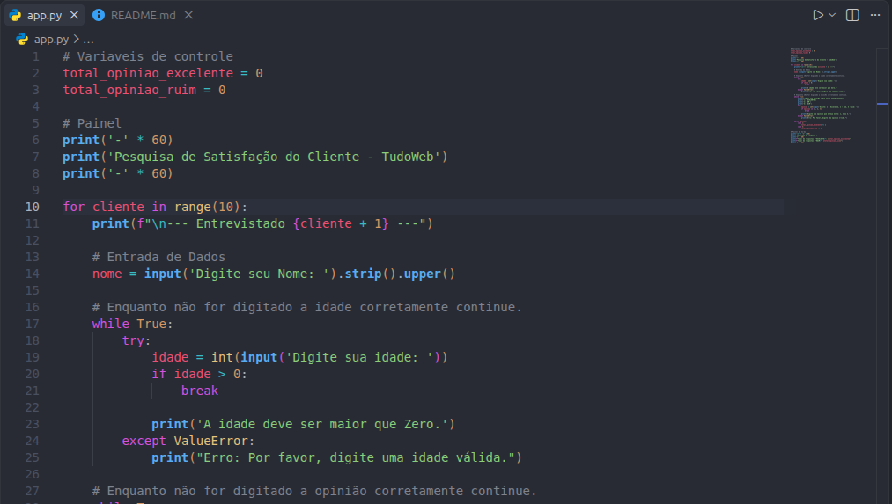
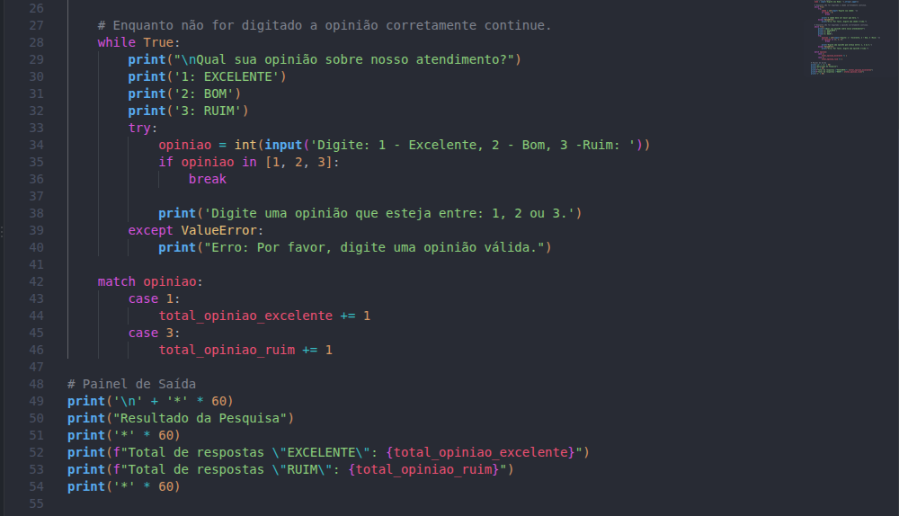
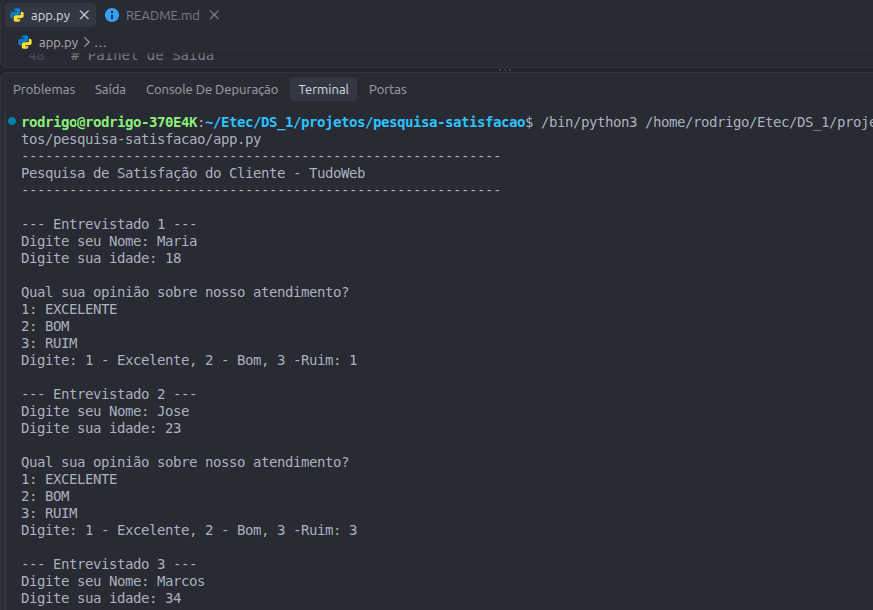
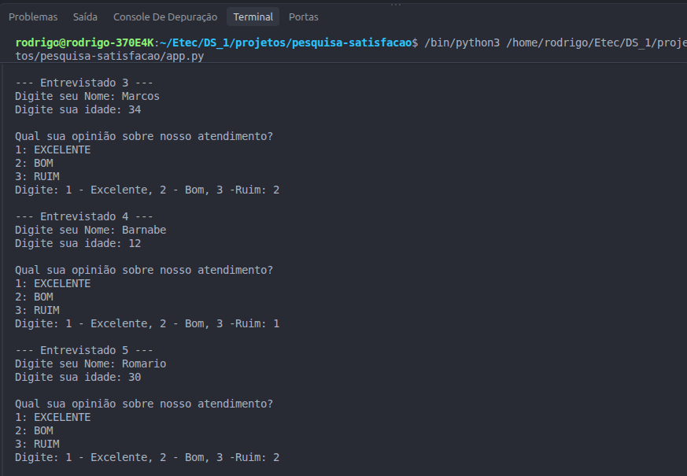
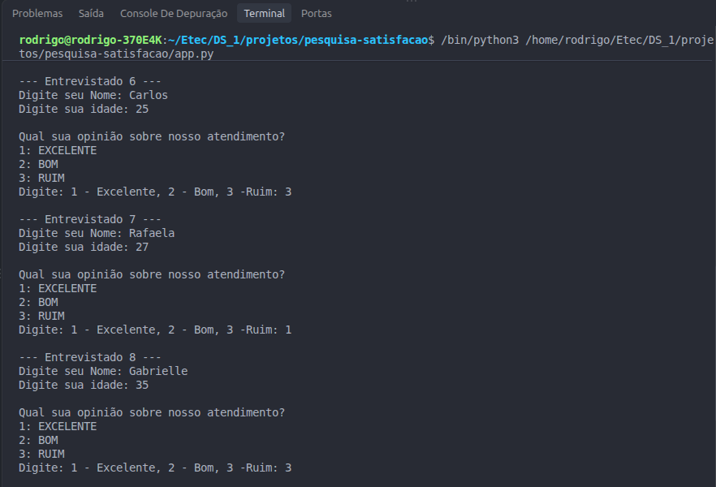
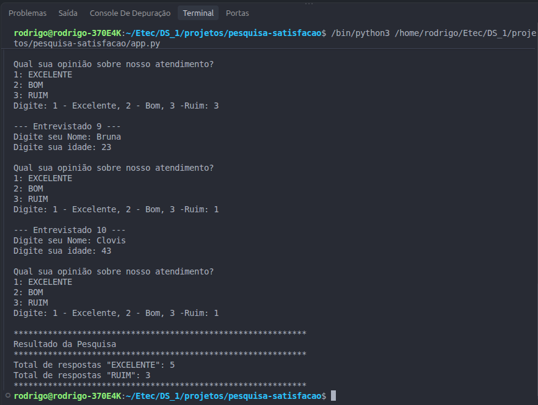

# 📊 Sistema de Pesquisa de Opinião - TudoWeb

## 🎯 Objetivo do Sistema
Este projeto é um **Sistema de Pesquisa de Opinião** desenvolvido em Python para a empresa de marketing TudoWeb. O objetivo é realizar uma pesquisa com clientes para avaliar o grau de satisfação no atendimento prestado, coletando dados estruturados em lote e emitindo um relatório final consolidado.

## 💻 Linguagem Utilizada
- **Python 3**

## ⚙️ Funcionalidades e Regras de Negócio
- O programa realiza um ciclo de repetição para coletar as respostas de 50 entrevistados.
- O sistema solicita o nome, a idade e a avaliação do atendimento com as seguintes opções:
  - **1:** EXCELENTE
  - **2:** BOM
  - **3:** RUIM
- Inclui validação contínua de dados com tratamento de erros (`try/except`) para impedir o avanço caso a idade ou o código da opinião sejam informados em formato inválido.
- Ao final, o programa exibe no painel:
  - A quantidade de respostas "EXCELENTE"
  - A quantidade de respostas "RUIM"

## 💻 Telas do Projeto

### Código Fonte
*(Insira aqui o print da tela do seu código. Arraste a imagem para cá ou use o formato abaixo)*

### Execução do Programa
*(Insira aqui o print da tela do terminal mostrando o programa rodando)*

## 🚀 Como executar o programa

1. Certifique-se de ter o Python instalado em sua máquina.
2. Clone este repositório ou faça o download dos arquivos.
3. Abra o terminal e navegue até a pasta do projeto.
4. Execute o arquivo principal: `python app.py` (ou insira o nome exato do seu arquivo `.py`).